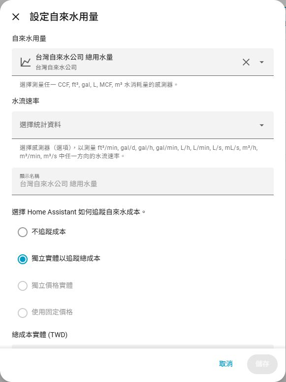
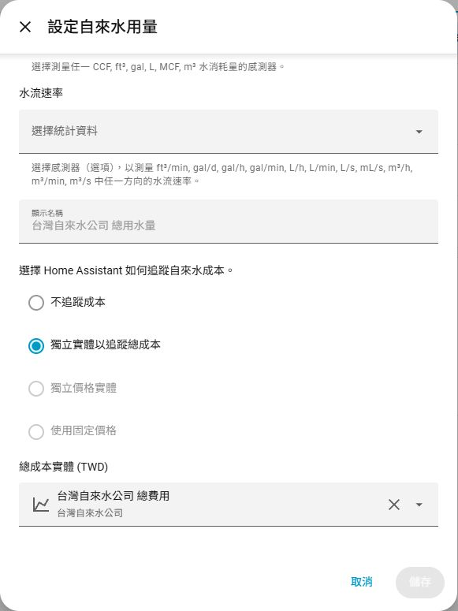

# HACS 台灣自來水公司帳單匯入

在 Home Assistant 查詢台水帳單、用水量與費用。填入水號及戶名即可使用。

非台水官方整合，適用台灣自來水公司，不適用臺北自來水事業處。

[English](docs/README.en.md) · [完整使用指南](docs/usage.md) · [爬蟲排程與狀態](docs/live-check.md) · [更新紀錄](CHANGELOG.md)

## 功能

- 帳單明細、用水量、費用、歷史紀錄及可取得的碳排資料。
- 自動排程、立即查詢最新一期、補抓歷史與重建統計按鈕。
- 上次／下次查詢時間，以及獨立的查詢、OCR、台水驗證及統計狀態。
- 能源面板可用的「台灣自來水公司 總用水量」與費用統計，無須自建 helper 或 YAML。
- 支援多帳戶、自訂顯示名稱及人工驗證備援；查詢失敗保留已保存帳單。

## 安裝

需要 **Home Assistant 2026.9.1 以上**。已驗證 Core 2026.9.1 的 amd64／aarch64；其他版本及 32 位元平台尚未驗證。

**HACS**

1. 先安裝 HACS，點頁首按鈕開啟儲存庫；也可在 HACS「自訂儲存庫」加入 `https://github.com/yitsewu/taiwan-water`，類型選「整合」。
2. 下載整合，重新啟動 Home Assistant。

**ZIP 安裝**

1. 從 [Releases](https://github.com/yitsewu/taiwan-water/releases) 下載 `taiwater-版本.zip`。
2. 將壓縮檔中的完整 `custom_components/taiwater` 資料夾放入 HA 的 `/config/custom_components/`，重新啟動 HA。

更新前先備份 HA；更新後保留既有帳戶與歷史，不需重填水號、戶名。

## 設定

1. 前往「設定 → 裝置與服務 → 新增整合」，搜尋「台灣自來水公司」。
2. 填入水號與戶名，可自訂顯示名稱。首次預設取得原站可提供的全部帳期。
3. 在整合選項調整查詢排程；預設每週一 09:00。
4. 在能源面板的用水設定選擇「台灣自來水公司 總用水量」及對應費用統計。

## 匯入能源面板

先等待台水整合的「長期統計狀態」顯示「已完成」，再開啟 **能源 → 編輯主面板 → 自來水 → 增加自來水來源**。

| ① 選擇用水量 | ② 加入費用 |
| :--- | :--- |
| 「自來水用量」選 **台灣自來水公司 總用水量**；「水流速率」留空，顯示名稱可自行填寫。 | 往下捲動，選 **獨立實體以追蹤總成本**；總成本選 **台灣自來水公司 總費用**，按「儲存」。 |
|  |  |

點擊圖片可查看原尺寸。

截圖為已設定來源的編輯畫面，因此「儲存」呈灰色；新增或修改選項後即可儲存。若有自訂裝置名稱，請選擇對應名稱的統計。

**3. 查看結果**

回到 **能源 → 自來水**，即可查看用水量及費用。選擇有帳單資料的月份或年份；新來源最多可能需要 2 小時才顯示。圖表依帳單期間分攤估算，並非即時用水量。

## 自動爬蟲排程

| 用途 | 執行位置 | 頻率與內容 |
| --- | --- | --- |
| 自動匯入自己的帳單 | Home Assistant | 預設每週一 09:00；可改每日、每週或每月，依 HA 時區執行，補齊缺少帳期並更新最新一期 |
| 公開相容性檢查 | GitHub Actions | 每 6 小時，台灣時間 02:23、08:23、14:23、20:23；驗證最新正式版的內建 OCR、台水驗證與帳單解析，不寫入 HA |

在整合選項調整時間與頻率，或使用「自動查詢」開關暫停排程。每月日期超過當月天數時，改在月底執行。GitHub 排程可能延遲；徽章與家中 HA 的查詢結果各自獨立，詳細狀態見[爬蟲排程與狀態](docs/live-check.md)。

## 帳單內容

| 資料 | 說明 |
| --- | --- |
| 帳期與用水量 | 最新帳單月份、本期用水度數及可查歷史 |
| 費用與計費期間 | 原始應繳總額、費用細項及官網提供的日期 |
| 繳費狀態 | 官網有提供時顯示；沒有資料時保持未知 |
| 分攤與年度摘要 | 月度用水、費用、碳排及已涵蓋月份；不代表完整年度實測 |

官網日後移除舊帳期時，已保存歷史仍保留。「補抓歷史」可重新查詢設定範圍內的帳單，更新修正過的舊資料。

## 月度分攤

新帳戶預設按帳單涵蓋月份平均分配。例如兩個月一期 **60 度、600 元 → 每月 30 度、300 元**；其他帳期依實際涵蓋月份分配。

這是**帳單分攤估算，不是每月實際抄表量**。進階選項可改為按實際天數分攤。既有帳戶沿用原設定；切換方式後會重建統計，也可按「重建長期統計」重試，歷史 ID 保持不變。

碳排使用原站數值，或自行設定含來源與年份的碳排係數；缺少資料時顯示未知。

## 操作與故障排除

- 「立即查詢最新一期」：重新查詢最新帳單。
- 「補抓歷史」：回填或更新設定範圍內的帳單。
- 「重建長期統計」：從已保存帳單重建能源統計，不查官網、不執行 OCR。
- 查詢失敗時查看查詢、OCR 及台水驗證狀態；OCR 成功不代表台水驗證通過。需要時可使用人工驗證備援。
- 帳單查詢成功但能源尚未更新時，查看「長期統計狀態」，等待完成或重建統計。

詳細選項與排解方式見[完整使用指南](docs/usage.md)。

## 資料來源

資料來自台灣自來水公司的[水費查詢網站](https://www.water.gov.tw/ch/EQuery/WaterFeeQuery?nodeId=753)。本整合使用填入的水號與戶名，依網站驗證流程取得帳單明細，再整理為 Home Assistant 的用水量、費用與歷史統計。

## 問題回報

回報問題請到 [Issues](https://github.com/yitsewu/taiwan-water/issues)，勿附上水號、戶名、Cookie、驗證碼或原始帳單。

## 授權

程式碼採用 [MIT License](LICENSE)。內建 OCR 模型沿用 ddddocr 的 [MIT 授權](custom_components/taiwater/models/LICENSE.ddddocr.txt)，並保留[來源與完整性資訊](custom_components/taiwater/models/source.json)。台水標誌權利歸台灣自來水公司所有，不包含在程式碼的 MIT 授權中。
